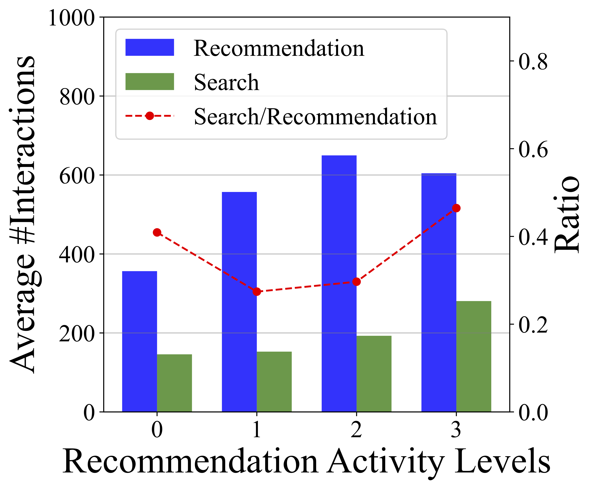
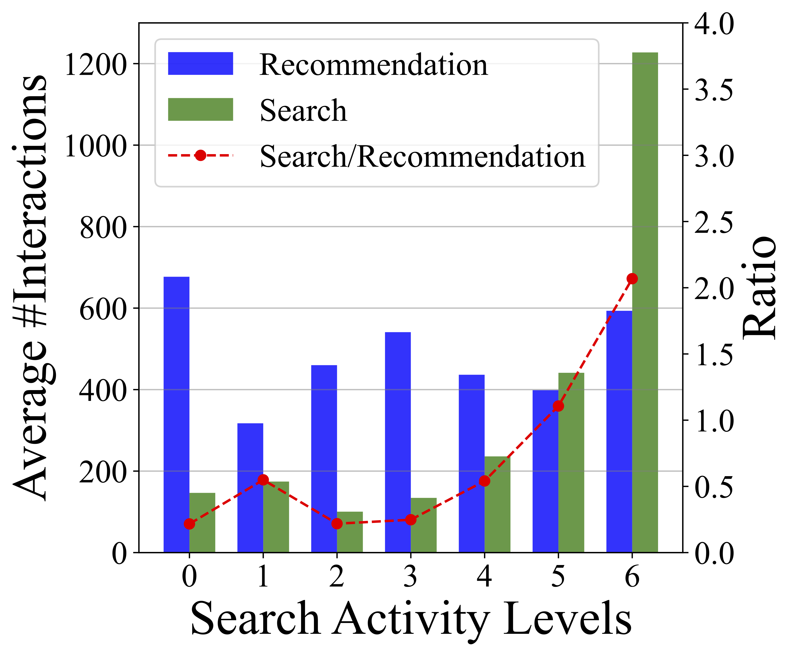
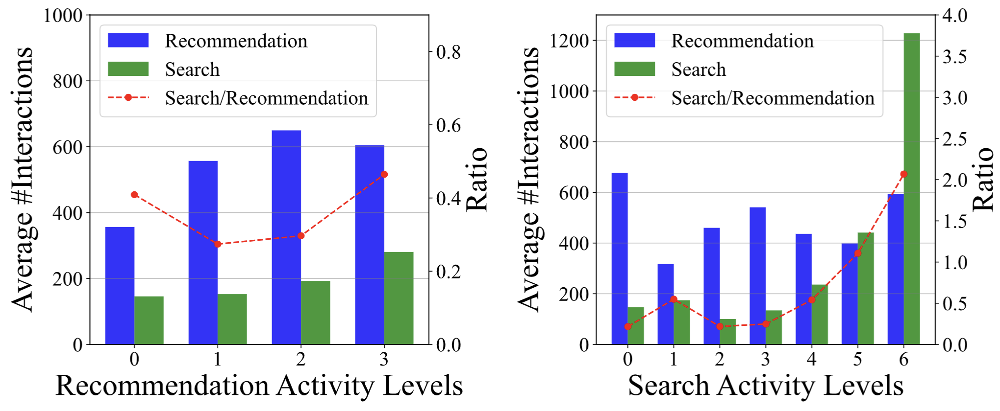

[HOMEPAGE](./)

## Data Descriptions:

File organization:

```bash
  KuaiSR
  ├── rec_inter.csv          
  ├── src_inter.csv
  ├── social_network.csv
  ├── user_features.csv
  └── item_features.csv
```


#### 1. Descriptions of the fields in rec_inter.csv


| Field Name           | Description                                                  | Type      | Example       |
| -------------------- | ------------------------------------------------------------ | --------- | ------------- |
| user_id              | The ID of the user.                                          | int64     | 1             |
| item_id              | The ID of the viewed item.                                   | int64     | 1             |
| playing_time         | Time of item viewing of this interaction (millisecond).      | float64   | 60792.0       |
| duration_ms          | Time of this item (millisecond).                             | float64   | 45400.0       |
| time                 | Human-readable date for this interaction (China,  Beijing time zone) | timestamp | 2023-05-22 15:53:20 |
| timestamp            | Unix timestamp (millisecond).                                | float64   | 1.684742e+12  |
| click                | Whether the user clicks the item.                            | int64     | 1             |
| forward              | Whether the user forwards the item.                          | int64     | 1             |
| like                 | Whether the user likes the item.                             | int64     | 1             |
| follow               | Whether the user follows the author of from the item.        | int64     | 1             |
| search               | Whether the user actively searches while watching items in the recomendation system.           | int64     | 1             |
| search_item_related  | Whether the content that users search for related to the currently watched video. | int64     | 1             |

For recommendation actions, the ratio of data with click=0 and click=1 is approximately 1:1. We recommend using 'click' to distinguish positive and negative samples.

It is important to note that the 'search_item_related' label is only valid when 'search' is equal to 1. Additionally, both 'search_item_related' and 'search' only consider the user's active search behavior by clicking on the magnifying glass icon, without taking into account other search behavior such as clicking on recommended queries in the comment section.


#### 2. Descriptions of the fields in src_inter.csv

| Field Name             | Description                                                               | Type      | Example          |
| ---------------------- | ------------------------------------------------------------------------- | --------- | ---------------- |
| user_id                | The ID of the user.                                                       | int64     | 14358            |
| search_session_id      | The ID of each search session.                                            | int64     | 1                |
| search_session_time    | Human-readable date for this search session (China, Beijing time zone).   | float64   | 2023-05-22 21:58:52 |
| search_session_timestamp | Unix timestamp (millisecond).                                            | float64   | 1684763932919    |
| keyword                | The keyword of the search session after anonymization.                    | list      | [20, 34, 3]      |
| search_source          | Search source of the search session                                       | string    | USER_INPUT       |
| item_id                | The item ID shown to the user in the search session.                      | int64     | 103656000000     |
| click_cnt              | Whether user click the shown item.                                        | int64     | 1                |
| item_type              | Item type of the shown item ("VIDEO", 'USER', 'IMAGE_ATLAS', 'LIVE', 'COMMODITY', 'MUSIC', 'ADVERT'). | string | VIDEO           |


It is important to note that we define a user's search behavior as a search session, which includes issuing a query and providing feedback on the returned results. Within a search session, a user may click on multiple items after searching a query or may choose not to click on any item. Approximately 60% of the search sessions in this dataset include click behavior, meaning there is at least one item with click=1.
The user behaviors of searching without clicking may be due to the auto-play feature of the KuaiShou app. In some cases, after the video auto-plays and satisfies the user's information needs, the user exits the search system.

Furthermore, the search engine may return results that include items not present in the recommendation system. The recommendation system only recommends items with item_type "VIDEO" or "IMAGE_ATLAS" to users, while the search engine may return other types of items such as live streams ("LIVE") or user profiles ("USER").

#### 3. Descriptions of the fields in social_network.csv

| Field Name      | Description                                       | Type  | Example     |
| --------------- | ------------------------------------------------- | ----- | ----------- |
| user_id         | The ID of the user.                               | int64 | 19270 |
| user_follow_id  | ID of the user followed by the current user.      | int64 | 19270 |

'user_follow_id' only contains users who have appeared in this dataset.


#### 4. Descriptions of the fields in user_features.csv


| Field Name         | Description                               | Type  | Example |
| ------------------ | ----------------------------------------- | ----- | ------- |
| user_id            | The ID of the user.                       | int64 | 6302 |
| search_active_level| Search activity level of the user.          | int64 | 1       |
| rec_active_level| Recommendation activity level of the user.          | int64 | 1       |
| onehot_feat1       | An encrypted feature. Range: {0, 1, 2}    | int64 | 1       |
| onehot_feat2       | An encrypted feature. Range: {0, 1, …, 7} | int64 | 3       |


#### 5. Descriptions of the fields in item_features.csv

| Field Name                   | Description                                                      | Type      | Example     |
| ---------------------------- | ---------------------------------------------------------------- | --------- | ----------- |
| item_id                      | The ID of the item.                                              | int64     | 1           |
| caption                      | The caption of the item after anonymization.                     | list      | [1, 213, 24]|
| author_id                    | The ID of the author (0 is padding).                                             | int64     | 10          |
| item_type                    | The type of the item.                                            | string    | NORMAL      |
| upload_time                  | The upload datetime of the item (human readable: China,  Beijing time zone, 1970-1-1 is padding). | timestamp | 2023-04-22  |
| upload_type                  | Type of item uploaded.                                           | string    | LongImport  |
| first_level_category_id      | ID of the first level category for the item                      | int64     | 9           |
| first_level_category_name    | Name of the first level category for the item                    | string    | 搞笑         |
| first_level_category_name_en | English name of the first level category for the item            | string    | Funny       |
| second_level_category_id     | ID of the first second category for the item                     | int64     | 136         |
| second_level_category_name   | Name of the second level category for the item                   | string    | 搞笑段子      |
| second_level_category_name_en| English name of the second level category for the item           | string    | Funny joke  |
| third_level_category_id      | ID of the third level category for the item                      | int64     | 0           |
| third_level_category_name    | Name of the third level category for the item                    | string    | 空           |
| third_level_category_name_en | English name of the third level category for the item            | string    | empty       |
| fourth_level_category_id     | ID of the fourth level category for the item                     | int64     | 0           |
| fourth_level_category_name   | Name of the fourth level category for the item                   | string    | 空           |
| fourth_level_category_name_en| English name of the fourth level category for the item           | string    | empty       |


## Analysis

This dataset filters users based on a single condition: that users have used both S\&R services  within the specified time period.
As a result, the final dataset encompasses users with diverse levels of activity in either the search or recommendation services, thereby offering a comprehensive representation of users with varying degrees of engagement.
To illustrate the number of S\&R behaviors among users with different activity levels, we counted the number of user-video interactions within two services respectively.
We have grouped users based on their activity levels in the search or recommendation services. 
The activity level is determined by the number of active days within the past month using the respective service. 
A higher activity level indicates a larger number of active days.
The results are illustrated as follows:

<!-- <div style="display: flex;">
    
    
</div> -->
{:width="90%"}


The average number of search or recommendation historical behaviors per user is over one hundred.  The overall interaction frequency with the recommendation service surpasses that with the search service. Furthermore, we observed that within the groups with either the lowest or highest activity levels in recommendations, as well as within the group with high search activity, there is a higher proportion of search interactions.