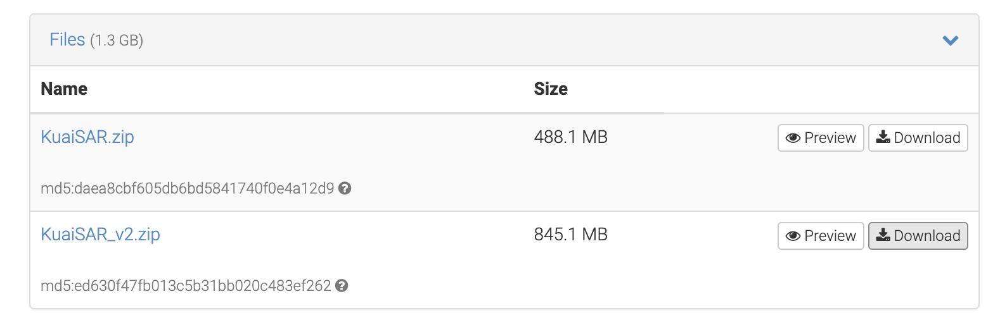

# KuaiSAR

*KuaiSAR* is a unified search and recommendation dataset containing the genuine user behavior logs collected from the short-video mobile app, [Kuaishou (快手)](https://www.kuaishou.com/en), a leading short-video app in China with over 300 million daily active users.   
**It is the first dataset which records genuine user behaviors, the occurrence of each interaction within either search or recommendation service, and the users' transitions between the two services!** 


## Overview:

As shown in the following figure, Kuaishou provides both search and recommendation services.
The figure illustrates integrated search and recommendation scenarios in Kuaishou app. 
When watching a video, the user can either scroll up and down to browse different videos with the recommendation service (from middle to left); or
tap on the magnifying glass to access the search service (from middle to right).


From the user's perspective, the boundary between search and recommendation services may not be distinct. 
Users experience a unified service that combines both search and recommendation functionalities.
In the recommendation service, as illustrated in the figures below (a. and b.), there exist several designs that prompt users to transition into the search service. 
Similarly, in the search service, as shown in the figures below (c. and d.), various recommended queries are presented to stimulate users to engage in further searching.


The other two related datasets are: [KuaiRec](https://kuairec.com/) and [KuaiRand](https://kuairand.com/).
 
### Advantages:

Compared with other existing datasets, KuaiSAR has the following advantages:

- ✅ It is the first dataset with user genuine search and recommendation behaviors. 
- ✅ It documents the sources of users' search behaviors, such as actively typing-in searches and clicking on recommended queries.
- ✅ It comprehensively captures users' transitions between search and recommendation services, such as documenting whether users initiate a search while watching a video within the recommendation system.
- ✅ It provides abundant side information for both users and items.
- ✅ It logs users' authentic interactions, including both positive and negative feedback.

### Statistics

Here we show some basic statistics.
Check this page for more detailed [Descriptions and Analytics](./detailed_statistics.html).

KuaiSAR contains genuine search and recommendation behaviors of 25,877 users within a span of 9 days on the Kuaishou app.
This dataset filters users based on a single condition: that users have used both search and recommendation services within the specified time period ranging from 2023/5.22 14:30 to 2023/6.10 9:30. 
<!-- This dataset filters users based on a single condition: that users have used both search and recommendation services within the specified time period ranging from 2023/5.22 14:50 to 2023/5.31 14:50.  -->
As a result, the final dataset encompasses users with diverse levels of activity in either the search or recommendation services, thereby offering a comprehensive representation of users with varying degrees of engagement.
Basic statistics of this dataset in the are summarized as follows:

**KuaiSAR**
<style>
table {
  width: 80%;
  margin-left: auto;
  margin-right: auto;
}
</style>

| Dataset | #Users  | #Items    | #Queries | #Actions    |
|---------|---------|------------|---------|------------|
| S-data  | 25,877  | 3,026,189 | 453,667   | 5,059,169   |
| R-data  | 25,877  | 4,046,367 | -       | 14,605,716 |
| Total   | 25,877  | 6,890,707 | 453,667   | 19,664,885 |

where the 'S' and 'R' denote search and recommendation respectively.


In order to facilitate researchers to conduct experiments more quickly, we have also released a smaller version of the data.
*The difference is that KuaiSAR contains data from 2023/5/22 14:30 to 2023/6/10 9:30, while KuaiSAR-small only contains data from 2023/5/22 14:50 to 2023/5/31 14:50.*

**KuaiSAR-small**
<style>
table {
  width: 80%;
  margin-left: auto;
  margin-right: auto;
}
</style>

| Dataset | #Users | #Items | #Queries | #Actions |
|-----|-----|-----|-----|-----|
|  S-data  |  25,877   |  2,012,476   |  267,608   |   3,171,231  |
|  R-data   |  25,877   |  2,281,034   | --  |   7,493,101  |
|  Total   |   25,877  |   4,195,529  |   267,608  |  10,664,332   |

The short descriptions for each feature filed are listed as below. Please refer to this [page](./detailed_statistics.html) for more details and examples.

| **Feature**:  | Detailed Descriptions. |
|------------------------|---------------------------------------------------------------------------------------|
| **User&Item feature**:  | Users and items have abundant side information. 5 (18) features for users (items). |
| **S-action feature**:  | S-actions have 9 features, e.g., search session IDs, query keywords, and sources of entering the search service. |
| **R-action feature**:  | R-actions has 12 features, including 9 types of user feedback, e.g., likes, follows, and entering search. |
| **Social network**:    | 576 users have friends. |


## Download the data:

KuaiSAR has been shared at [https://zenodo.org/record/8181109](https://zenodo.org/record/8181109).

[](https://doi.org/10.5281/zenodo.8181109)

OPTION 1. Download via your browser:

You can download the dataset from this [link](https://zenodo.org/record/8181109).

**Note:**

* The 'KuaiSAR_v2.zip' file is for the **KuaiSAR** dataset.
* The 'KuaiSAR.zip' file is for the **KuaiSAR-small** dataset.

The screenshot of the data download page:


OPTION 2: Download via the 'wget' command tool:

For the **KuaiSAR** dataset:
```bash
wget https://zenodo.org/record/8181109/files/KuaiSAR_v2.zip

unzip KuaiSAR_v2.zip
```

For the **KuaiSAR-small** dataset:
```bash
wget https://zenodo.org/record/8181109/files/KuaiSAR.zip

unzip KuaiSAR.zip
```


## Citation


If you find it helpful, please cite our paper:
 [](https://arxiv.org/abs/2306.07705) [](https://arxiv.org/pdf/2306.07705.pdf)

```
@article{Sun2023KuaiSAR,
  title={KuaiSAR: A Unified Search And Recommendation Dataset},
  author={Zhongxiang Sun and Zihua Si and Xiaoxue Zang and Dewei Leng and Yanan Niu and Yang Song and Xiao Zhang and Jun Xu},
  booktitle={Proceedings of the 32nd ACM International Conference on Information and Knowledge Management},
  url = {https://doi.org/10.1145/3583780.3615123},
  doi = {10.1145/3583780.3615123},
  year={2023},
}
```

## License

[![CC BY-NC-SA 4.0][cc-by-nc-sa-shield]][cc-by-nc-sa]

This work is licensed under a
[Creative Commons Attribution-NonCommercial-ShareAlike 4.0 International License][cc-by-nc-sa].

[![CC BY-NC-SA 4.0][cc-by-nc-sa-image]][cc-by-nc-sa]

[cc-by-nc-sa]: http://creativecommons.org/licenses/by-nc-sa/4.0/
[cc-by-nc-sa-image]: https://licensebuttons.net/l/by-nc-sa/4.0/88x31.png
[cc-by-nc-sa-shield]: https://img.shields.io/badge/License-CC%20BY--NC--SA%204.0-lightgrey.svg

